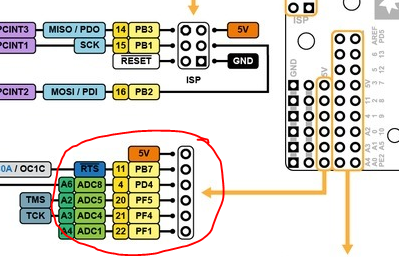
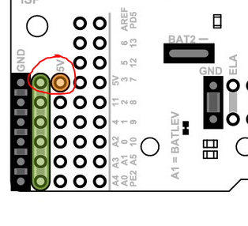

# WPILibWS Reference Robot (Romi)

## Hardware Changes
TODO Include image

We will use a set of 5 pins to provide additional I/O capability to the Romi board. These pins are:

- Pin 11
- Pin 4 / Analog 6
- Pin 20 / Analog 2
- Pin 21 / Analog 3
- Pin 22 / Analog 4

You can see them on the front left side of the Romi board. For easy interfacing, solder a bunch of pin headers for those 5 pins, and the power rails.

Additionally, the middle power rail is not connected to anything, so solder another set of jumpers between that and the 5V pin (next to pin 11). Adding a jumper here will provide power to the middle rail.

## Software Changes
TODO ServoT3

## Pin Mappings
For simplicity, we provide a hardcoded mapping of WPILib channels/devices to a subset of the IO pins available on the Romi.

Some of the channels are mapped to on-board hardware (buttons, LEDs, motors, encoders etc). There are 5 external interface pins (see the hardware section above) that are hard coded for specific functionality.

### Digital I/O
- DIO 0 -> Button A (input only)
- DIO 1 -> Button B (input), Green LED (output)
- DIO 2 -> Button C (input), Red LED (output)
- DIO 3 -> Yellow LED (output only)
- DIO 4 -> Reserved for Left Encoder Channel A
- DIO 5 -> Reserved for Left Encoder Channel B
- DIO 6 -> Reserved for Right Encoder Channel A
- DIO 7 -> Reserved for Right Encoder Channel B
- DIO 8 -> Pin 11

Writes to DIO 0, 4, 5, 6 and 7 will result in no-ops.

### Analog Input
- AIN 0 -> Analog 6 / Pin 4
- AIN 1 -> Analog 2 / Pin 20

### PWM Output
- PWM 0 -> Left Motor
- PWM 1 -> Right Motor
- PWM 2 -> Pin 21 / A3
- PWM 3 -> Pin 22 / A4
